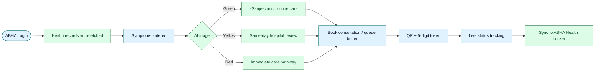
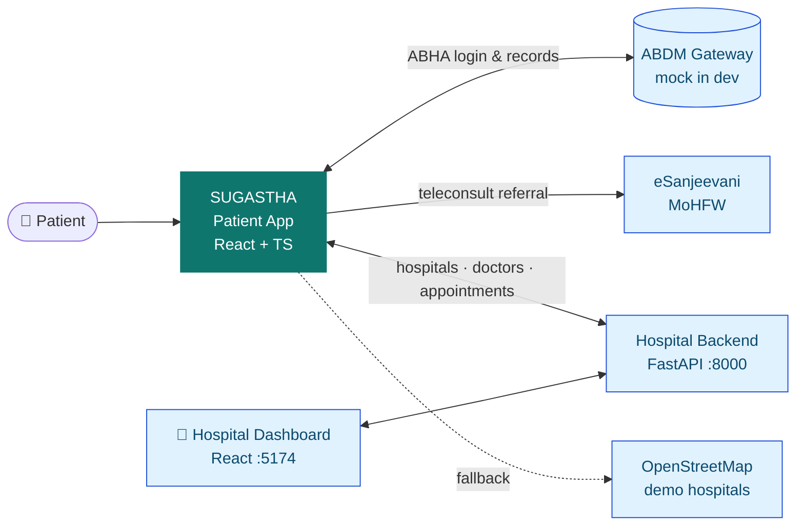
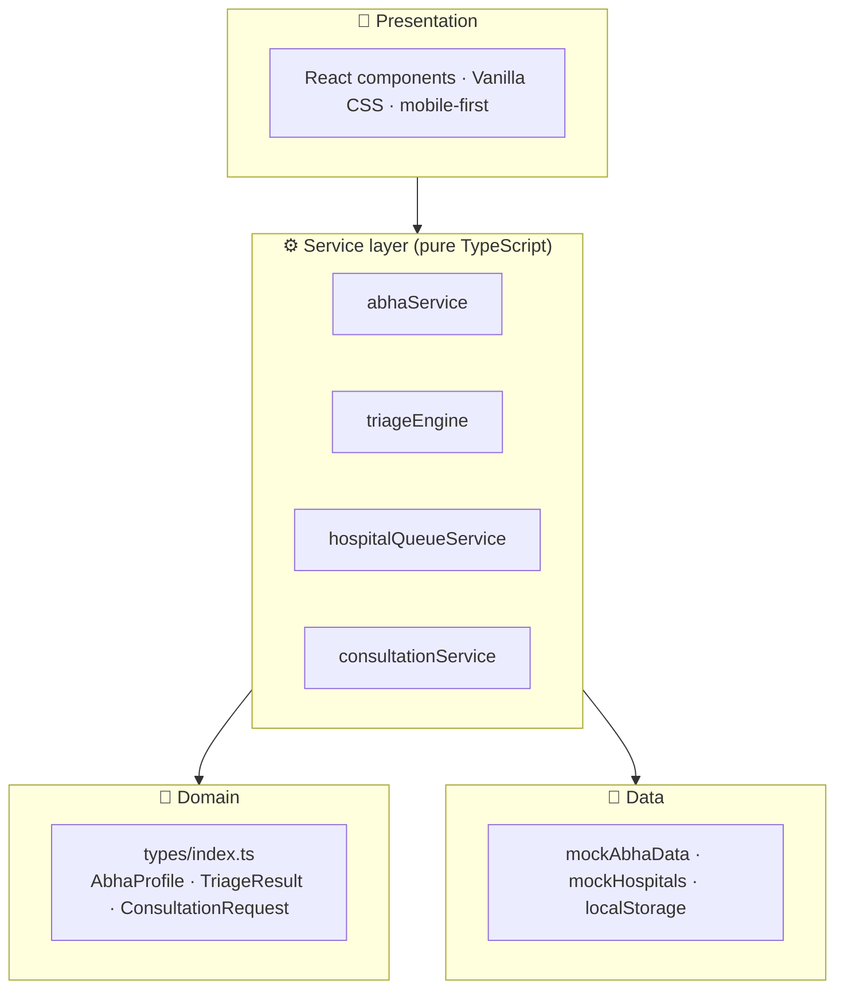
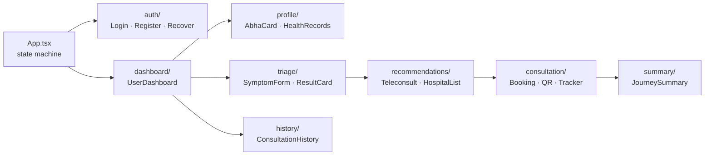
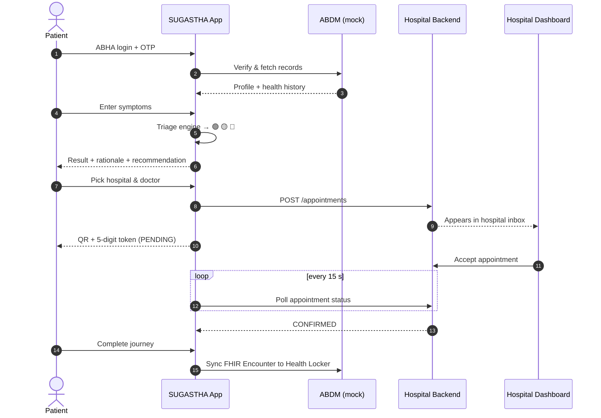
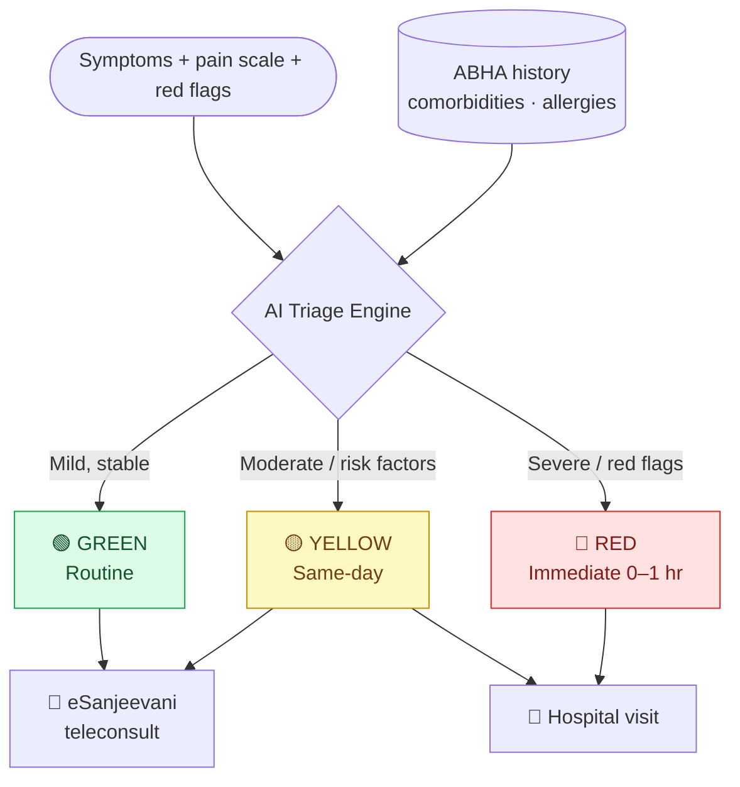
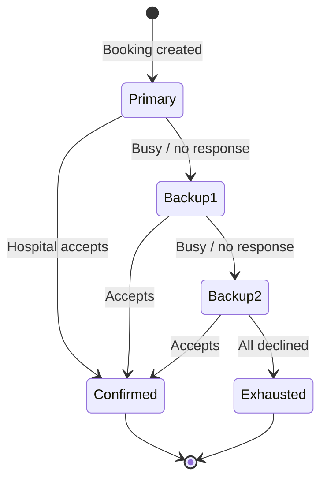
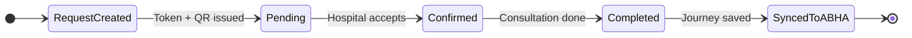
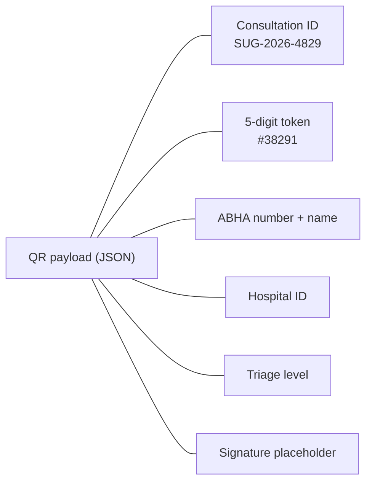
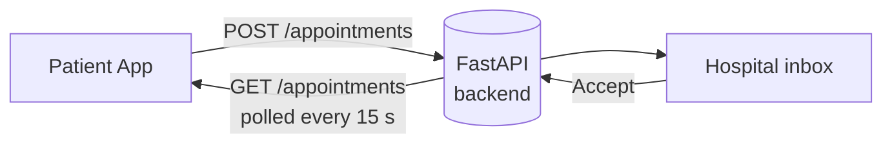

<div align="center">
  
</div>

<a href="https://git.io/typing-svg">
  
</a>

<br/>


**An Ayushman Bharat Digital Mission (ABDM) compliant, citizen-centric web app: ABHA login, AI clinical triage, hospital queue buffering, QR consultation tokens, and ABHA record sync.**

[Overview](#-overview) · [Architecture](#-architecture) · [Quick Start](#-quick-start) · [Flows](#-flows-at-a-glance) · [Integration](#-hospital-integration) · [Config](#-configuration)

</div>

---

## 🌟 Overview

SUGASTHA is the **patient-side** app. A citizen logs in with ABHA, describes symptoms, gets an automatic triage level, and is routed to teleconsultation or a hospital, with a backup-hospital safety net and a scannable pass.



> ⚠️ **Scope:** The hospital dashboard is a separate app (`SUGASTHA-hospital-dashboard-main/`). The two talk over the REST API described in [Hospital Integration](#-hospital-integration).

---

## ✨ Key Features

| | Feature | What it does |
|---|---|---|
| 🪪 | **ABHA Auth** | Login, Aadhaar-KYC registration, and ID recovery |
| 🏥 | **Health Records** | Prescriptions, diagnoses, labs, allergies, chronic conditions |
| 🤖 | **AI Triage** | Rule-based engine, Green / Yellow / Red, with clinical rationale |
| 📡 | **eSanjeevani-ready** | Teleconsult referral with inspectable API payload |
| 🏨 | **Hospital Ranking** | By condition, triage, distance, fare estimate, specialist availability |
| 📊 | **3-Tier Queue** | Primary + 2 fallback hospitals, automatic failover |
| 🎫 | **QR + Token** | ABDM-style QR payload and 5-digit verification token |
| 📍 | **Live Tracker** | Request → Pending → Confirmed → Completed |
| 📁 | **ABHA Sync** | FHIR R4 `Encounter` bundle to the Health Locker |
| 📱 | **Mobile-first** | Desktop sidebar, mobile bottom-nav, Capacitor/RN-ready |

---

## 🏗 Architecture

### System context



### Layered design



> Services are framework-agnostic, so they port to React Native unchanged. Swap `abhaService.ts` method bodies for real ABDM Gateway calls when going live.

### Component map



<details>
<summary><b>📂 Project structure</b></summary>

```
SUGASTHA-user-dashboard/
├── index.html · vite.config.ts · tsconfig.json · package.json
└── src/
    ├── main.tsx · App.tsx
    ├── types/index.ts              # domain models
    ├── styles/                     # variables.css (tokens) · global.css
    ├── data/                       # mockAbhaData · mockHospitals
    ├── services/                   # abha · triage · hospitalQueue · consultation
    └── components/
        ├── common/  auth/  profile/  triage/
        └── recommendations/  consultation/  summary/  history/  dashboard/
```

</details>

---

## 🚀 Quick Start

**Requires:** Node.js ≥ 18 (20+ recommended), npm ≥ 9.

```bash
git clone https://github.com/YOUR_USERNAME/SUGASTHA-user-dashboard.git
cd SUGASTHA-user-dashboard
npm install
npm run dev          # → http://localhost:5173
```

| Command | Purpose |
|---|---|
| `npm run dev` | Dev server with hot reload |
| `npm run build` | Type-check + production bundle in `dist/` |
| `npm run preview` | Serve the production build locally |
| `npx tsc --noEmit` | Type-check only |

📱 To test on a phone, open `http://YOUR_LOCAL_IP:5173` on the same Wi-Fi.

### 🧪 Demo profiles

| Patient | ABHA Number | Expected triage |
|---|---|---|
| Rajesh Kumar Verma | `91-4523-8901-2345` | 🔴 **RED** (diabetes + hypertension + cardiac symptoms) |
| Ananya Sen | `91-7890-1234-5678` | 🟢🟡 **GREEN / YELLOW** (allergic rhinitis) |

Demo OTP auto-fills as `482910`.

---

## 🔄 Flows at a glance

### End-to-end sequence



### Triage decision



> The user is **never** asked to choose a priority. Triage is computed from current symptoms + ABHA history.

### 3-tier queue failover



### Consultation lifecycle



### QR pass & token



---

## 🔌 Hospital Integration

The patient app connects to the hospital FastAPI backend. Default base URL: `http://localhost:8000/api/v1`.

| Method | Endpoint | Used for |
|---|---|---|
| `GET` | `/hospitals/nearby-govt?lat=&lng=&limit=8` | Nearby registered hospitals |
| `GET` | `/doctors?hospital_id=` | Doctors at a hospital |
| `POST` | `/appointments` | Create booking (shows in hospital inbox) |
| `GET` | `/appointments?hospital_id=` | Poll status (every 15 s) |
| `POST` | `/appointments/{id}/accept` | Hospital accepts |



No webhooks or direct browser-to-browser links are used. If no registered hospital with doctors is available, the app falls back to OpenStreetMap/demo hospitals; those bookings are **local-only** and labelled as such before confirmation.

<details>
<summary><b>🛠 Local development with the hospital backend</b></summary>

1. Backend (`SUGASTHA-hospital-dashboard-main/backend`):
   ```bash
   # DATABASE_URL=sqlite:///./sugastha.db and a local JWT_SECRET_KEY must be set
   python -m app.db.seed                      # once, to seed demo data
   uvicorn app.main:app --reload --port 8000
   ```
2. Hospital frontend (`.../frontend`): `npm run dev -- --port 5174`
3. Patient frontend (this repo): `npm run dev`

To use a different backend, set `VITE_HOSPITAL_API_BASE_URL` in `.env.local` and restart Vite.

</details>

> ⚠️ **Prototype notice:** appointment write endpoints currently have no authentication and CORS is permissive. Use **synthetic data only** until auth and CORS restrictions are in place.

### eSanjeevani referral

```
POST https://esanjeevani.mohfw.gov.in/api/v2/patient/teleconsult-referral
```

The full payload is viewable in-app via **Inspect API Contract** on the Teleconsultation card.

---

## ⚙️ Configuration

```env
# Hospital backend (defaults to http://localhost:8000/api/v1 in dev)
VITE_HOSPITAL_API_BASE_URL=https://your-hospital-api.example.com/api/v1

# ABDM Gateway (production)
VITE_ABDM_GATEWAY_URL=https://dev.abdm.gov.in
VITE_ABDM_CLIENT_ID=your_client_id
VITE_ABDM_CLIENT_SECRET=your_client_secret

# eSanjeevani & maps
VITE_ESANJEEVANI_URL=https://esanjeevani.mohfw.gov.in/api/v2
VITE_MAPS_API_KEY=your_maps_api_key
```

- Put these in `.env.local` (already git-ignored).
- The API URL is the **backend**, not the hospital dashboard website. Verify it at `<API_ROOT>/health`.
- Vite embeds variables at **build time**, so redeploy after changing them.

---

## 📝 Development Notes

- **Mock data:** ABHA profiles live in `localStorage` via `mockAbhaData.ts`.
- **QR payload:** consultation ID, token, ABHA number, patient name, hospital ID, triage level, signature placeholder.
- **FHIR:** `HealthcareJourneySummary.fhirBundlePayload` holds a starter R4 `Encounter` structure for Health Locker submission.

---

## 🤝 Contributing

```bash
git checkout -b feature/my-feature
npx tsc --noEmit && npm run build     # verify
git commit -m "feat: add my feature"
```

Branch prefixes: `feature/` · `fix/` · `refactor/` · `docs/`

## 📄 License

MIT. See [LICENSE](./LICENSE).

<div align="center">


**SUGASTHA** — Built for the citizens of India 🇮🇳
<br/>Aligned with Ayushman Bharat Digital Mission (ABDM) standards

</div>